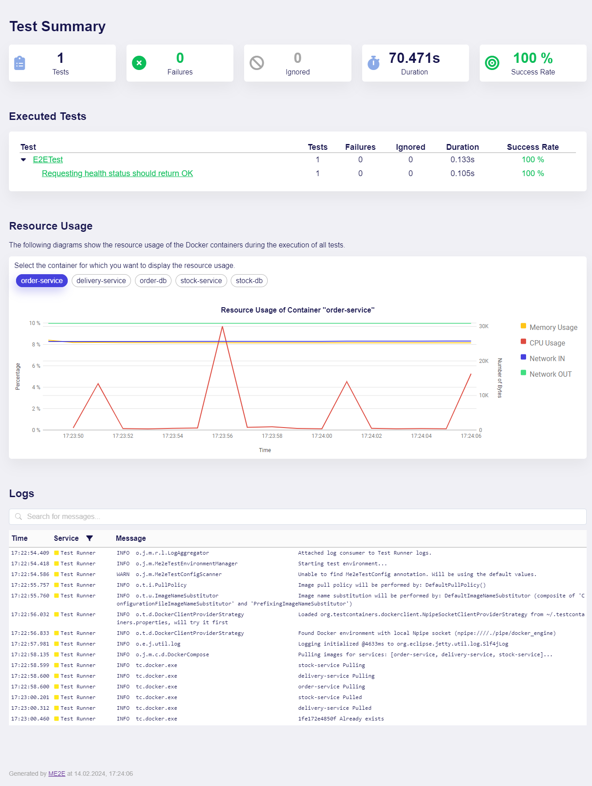
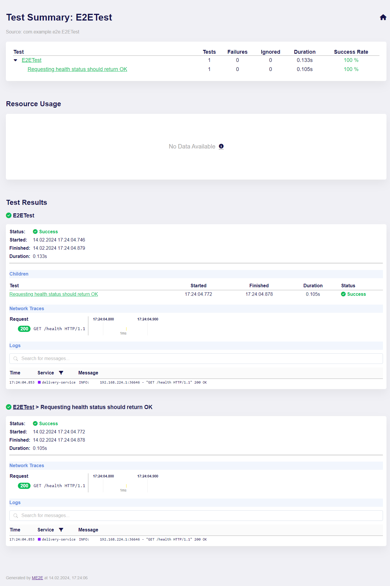
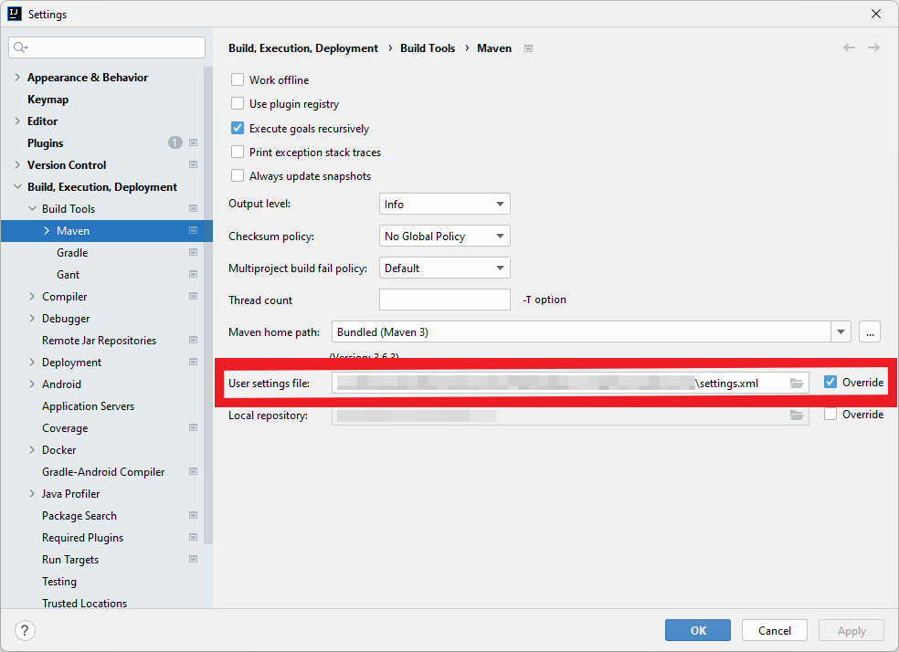

# me2e Library for End-to-End Tests for Microservice Systems
me2e (*Microservice End-to-End*) is a library for writing functional End-to-End-Tests for REST APIs of Microservice Systems in JUnit5.
These tests, referred to as *subcutaneous* by [Martin Fowler](https://martinfowler.com/bliki/SubcutaneousTest.html), can be used to verify whether the Microservices work together as expected at the level of their REST over HTTP APIs.

In contrast to testing Monoliths, testing Microservice Systems, which may consist of a multitude of independent components, poses numerous challenges.
One of these challenges is that one transaction usually spans across multiple services, which complicates debugging and makes the data flow difficult to trace.
In addition, the communication through the network increases the risk of *flaky* tests - that is tests that unpredictably produce sometimes positive and sometimes negative results without changes to the code base - which makes the test results unreliable and can no longer be relied upon as a safety net.
Furthermore, the heterogeneity of the individual components of a Microservice System also makes it difficult to set up the test environment on which the End-to-End-Tests are executed.

The fundamental aim of me2e is to reduce these difficulties when developing End-to-End-Tests for Microservice Systems and to simplify writing such tests with as little effort as possible.
To this end, me2e uses [JUnit5](https://junit.org/junit5/) (a.k.a. JUnit Jupiter) as a test framework and [Docker-Compose](https://docs.docker.com/compose/) for defining and setting up the test environment.
The library offers interfaces for the following core functions:
- **Setting up the Test Environment:** Using Docker-Compose, a temporary test environment is started for each execution of the End-to-End-Tests
- **Simulating external Services:** Mocking the REST APIs of third-party services
- **Data Management:** Setting the initial state of databases and resetting their state after each test
- **Executing HTTP Requests and Verifying their Responses**

In addition, a detailed test report is generated after the execution of all tests, which, besides basic metrics such as the success rate and execution times, also shows the logs of all Docker containers, their resource consumption over time and traces of the HTTP requests across the various components.

## Prerequisites
The definition and starting of the test environment relies on Docker and Docker-Compose.
Accordingly, a prerequisite for using this library is that the Microservices are available as Docker images and that Docker-Compose (version 1 or 2) is installed on the system that executes the tests.

## Getting Started
### 1. Set up a new Project
As the End-to-End-Tests affect the entire Microservice System and therefore cannot be assigned to an individual component, a new project should be set up for their development.
You can choose between Java and Kotlin for the programming language and between Gradle and Maven for the build tool.
The following explanations contain instructions for setting up the project with Gradle.
For Maven, the procedure is similar.

- Create a new directory for your project and switch into this directory.
```shell
mkdir e2e
cd e2e
```
- Execute the [Gradle `init`](https://docs.gradle.org/current/userguide/build_init_plugin.html) task.

<details>
    <summary><u>For <b>Java</b> Projects:</u></summary>
    
 ```shell
 gradle init \
   --type java-application \
   --test-framework junit-jupiter \
   --dsl groovy \
   --package com.example.e2e \
   --no-split-project
 ```
</details>

<details open>
    <summary><u>For <b>Kotlin</b> Projects:</u></summary>
    
```shell
gradle init \
  --type kotlin-application \
  --test-framework kotlintest \
  --dsl groovy \
  --package com.example.e2e \
  --no-split-project
```
</details>

### 2. Install the me2e Library
Add the me2e library as a test dependency to your project.

<details>
    <summary><u>For <b>Java</b> Projects:</u></summary>
    
 ```groovy
// build.gradle
dependencies {
     // ...
     testImplementation "org.jholsten:me2e:1.0.0"
     testAnnotationProcessor "org.jholsten:me2e:1.0.0"
}
 ```
</details>

<details open>
    <summary><u>For <b>Kotlin</b> Projects:</u></summary>
    
In case you are using Kotlin, you need to use the [kapt compiler plugin](https://kotlinlang.org/docs/kapt.html) for integrating the library's annotation processor.
    
```groovy
// build.gradle
plugins {
    // ...
    id "org.jetbrains.kotlin.kapt" version "1.8.20" // Should be the same as your Kotlin version
}
dependencies {
     // ...
     testImplementation "org.jholsten:me2e:1.0.0"
     kaptTest "org.jholsten:me2e:1.0.0"
}
 ```
</details>

### 3. Add the Docker-Compose of your Microservice System
Place the Docker-Compose file, which contains all the components of your Microservice System, in the `resources` folder of your newly created test project.
To be able to use the functions of the library as effectively as possible, you should make some configurations using labels in the [`labels` section](https://docs.docker.com/compose/compose-file/compose-file-v3/#labels-2) of the services.
For the most basic configuration, you should use the `org.jholsten.me2e.container-type` label to specify the container type of each service.

```yaml
# docker-compose.yml
services:
  microservice:
    # ...
    labels:
      "org.jholsten.me2e.container-type": "MICROSERVICE"
```

In me2e, we distinguish between <span id="container-types">3 different container types</span>:

| Container Type | Description                                                                                                                                                                                                                                                                                              | Represented by Class                                                                                                                                                          |
|:---------------|:---------------------------------------------------------------------------------------------------------------------------------------------------------------------------------------------------------------------------------------------------------------------------------------------------------|:------------------------------------------------------------------------------------------------------------------------------------------------------------------------------|
| `MICROSERVICE` | A Microservice that contains a publicly accessible HTTP REST API.<br/> With containers of this type, you can access their API via an HTTP client.                                                                                                                                                        | [`MicroserviceContainer`](https://master-thesis1.glpages.informatik.uni-bremen.de/me2e/kdoc/me2e/org.jholsten.me2e.container.microservice/-microservice-container/index.html) |
| `DATABASE`     | A container containing a database.<br/> With containers of this type, you can interact with the database by, for example, executing scripts or resetting the database state. Note that only MySQL, PostgreSQL, MariaDB and MongoDB are currently supported by default for interacting with the database. | [`DatabaseContainer`](https://master-thesis1.glpages.informatik.uni-bremen.de/me2e/kdoc/me2e/org.jholsten.me2e.container.database/-database-container/index.html)             |
| `MISC`         | All other container types that do not contain a publicly accessible REST API and are not database containers.<br/> You do not need to set the label for this type. It is used by default.                                                                                                                | [`Container`](https://master-thesis1.glpages.informatik.uni-bremen.de/me2e/kdoc/me2e/org.jholsten.me2e.container/-container/index.html)                                       |
 
To ensure that the test execution only starts when all services are completely up and running, you should also define a healthcheck for each service, if it does not already exist.

A minimally configured Microservice definition as part of the Docker-Compose file may look like this:
```yaml
# docker-compose.yml
services:
  delivery-service:
    image: gitlab.informatik.uni-bremen.de:5005/master-thesis1/evaluation/pizza-delivery/delivery-service:latest
    ports:
      - 8082
    healthcheck:
      test: ["CMD-SHELL", "curl --fail http://localhost:8082/health || exit 1"]
      interval: 5s
      timeout: 5s
      retries: 10
    labels:
      "org.jholsten.me2e.container-type": "MICROSERVICE"
```

### 4. Define the me2e-config File
For configuring the test runner, me2e relies on a me2e-config file in which you can define the test environment and adjust additional settings, such as the Docker-Compose version to be used or different timeouts.
You can find more information about the contents and format of the me2e-config file [here](#configuration).
For the minimal configuration, first create a file named `me2e-config.yml` in the `resources` folder of your test project with the following contents:

```yaml
# me2e-config.yml
environment:
  docker-compose: docker-compose.yml
```

<details id="autocomplete">
    <summary><b>Recommendation:</b> Enable Autocompletion in your IDE</summary>
    
To enable autocompletion and obtain descriptions for the fields of the `me2e-config.yml` file as well as for the [stub definitions for the Mock Servers](#stub-definition), you may load the corresponding JSON schema into the IDE.
You can find the JSON schemas for these files here:
- me2e-config files: https://master-thesis1.glpages.informatik.uni-bremen.de/me2e/json-schemas/config_schema.json
- stub definition files: https://master-thesis1.glpages.informatik.uni-bremen.de/me2e/json-schemas/stub_schema.json

If you are using IntelliJ, you can simply just download the [jsonSchemas.xml](https://master-thesis1.glpages.informatik.uni-bremen.de/me2e/json-schemas/jsonSchemas.xml) file and place it in the ".idea" folder of your test project.
After you have reloaded your project, IntelliJ will automatically link all files matching the pattern `me2e-config*.yml` to the config schema and all files matching `*stub.json` to the stub schema.
</details>

### 5. Write your first End-to-End-Test
Now that you have set everything up, you can write your first End-to-End-Test.
To do this, create a test class that inherits from [`org.jholsten.me2e.Me2eTest`](https://master-thesis1.glpages.informatik.uni-bremen.de/me2e/kdoc/me2e/org.jholsten.me2e/-me2e-test/index.html).

```kotlin
class E2ETest : Me2eTest() {
    
}
```

`Me2eTest` is the base class for all End-to-End-Tests, which contains references to all components of the environment.
You can use this class to access the containers via their names in the Docker-Compose file using the [`containerManager`](https://master-thesis1.glpages.informatik.uni-bremen.de/me2e/kdoc/me2e/org.jholsten.me2e/-me2e-test/-companion/container-manager.html).

```kotlin
val deliveryService = containerManager.containers["delivery-service"]
```

However, it is simpler and also the recommended procedure to inject the container instances using the [`@InjectService`](https://master-thesis1.glpages.informatik.uni-bremen.de/me2e/kdoc/me2e/org.jholsten.me2e.container.injection/-inject-service/index.html) annotation.
To do this, define an attribute in your test class with the name of the service to be injected.
The name of the attribute is automatically converted to Kebab-Case and an attempt is made to find a service in the Docker-Compose file that has exactly this key.

```kotlin
class E2ETest : Me2eTest() {

    @InjectService
    private lateinit var deliveryService: MicroserviceContainer
}
```

Alternatively, you can also specify the name of the service explicitly using the `name` parameter in the `@InjectService` annotation.
For more information on the annotation, see the section on [injecting services](#injecting-services).

You can now interact with the container and, in the case of a service of type `MICROSERVICE`, send requests to its REST API via the integrated HTTP client, for example.

```kotlin
val response = deliveryService.get(RelativeUrl("/health"))
```

To verify that the response meets the expectations, use the [`assertThat`](https://master-thesis1.glpages.informatik.uni-bremen.de/me2e/kdoc/me2e/org.jholsten.me2e.assertions/assert-that.html) method.
This method, in combination with the [`assertions`](https://master-thesis1.glpages.informatik.uni-bremen.de/me2e/kdoc/me2e/org.jholsten.me2e.assertions/), allows you to check all possible properties of the response.
To find out more about the available assertions, take a look [here](#verifying-http-responses).

```kotlin
class E2ETest : Me2eTest() {

    @InjectService
    private lateinit var deliveryService: MicroserviceContainer
    
    @Test
    fun `Requesting health status should return OK`() {
        val response = deliveryService.get(RelativeUrl("/health"))
        
        assertThat(response)
            .statusCode(equalTo(200))
            .body(containsString("OK"))
    }
}
```

### 6. Execute your End-to-End-Test
You can now run the tests either directly in your IDE or via the terminal with the following command:

```shell
./gradlew test
```

Before starting the test execution, the Docker-Compose is started and it is waited until all containers are healthy.
The tests are then executed and finally the report is generated using the [`HtmlReportGenerator`](https://master-thesis1.glpages.informatik.uni-bremen.de/me2e/kdoc/me2e/org.jholsten.me2e.report.generator.html/-html-report-generator/index.html), the path of which can be found in the logs.

The following report was generated for the E2E test example above:

| Landing Page                                               | Details                                                     |
|------------------------------------------------------------|-------------------------------------------------------------|
|  |  |

On the landing page, you can see an overview of all executed test classes and their tests as well as their execution status and duration.
Below the "Executed Tests" section you will also find statistics on the resource usage of all containers of the environment over the entire duration of the test execution.
Finally, in the bottom section you can see the aggregated logs of the Test Runner and all services of your environment that were collected during the execution.
As the environment is started before the actual test execution, you will also find the logs that were output when the environment was started here.

Clicking on the test class takes you to the details page of the report, where you can see the HTTP network traces and the specific logs for a test execution along with basic metrics for each test of a test class.
Please note that the resource usage statistics for a test class are only displayed if data was collected during the execution of the specific test class.
As Docker only sends the statistics entries once per second, you will not see any data at this point if the execution of the class took less than 1 second.

Detailed information on the contents of the test report and its customizability can be found [here](#test-report).

## Usage
In the following, the configuration options, a more detailed description of the options for creating tests as well as the test report are provided.
For the detailed Kotlin documentation, take a look [here](https://master-thesis1.glpages.informatik.uni-bremen.de/me2e/kdoc/index.html).

### Configuration
The configuration of the me2e library is mainly realized in the me2e-config file in YAML format.
The schema is divided into two sections at the top level:
- `settings`: Settings that affect the runtime execution of the tests, interactions with Docker and with the containers
- `environment`: Definition of the test environment

To enable autocompletion and obtain descriptions for the fields of the me2e-config file, follow the [instructions to load the JSON schema into your IDE](#autocomplete).

When the test execuction is started, the file `me2e-config.yml` is loaded from the `resources` folder, parsed and then the test environment is started.
To change the name of the config file to be searched for, you can annotate any class with the [`Me2eTestConfig`](https://master-thesis1.glpages.informatik.uni-bremen.de/me2e/kdoc/me2e/org.jholsten.me2e/-me2e-test-config/index.html) annotation anywhere in your project and set the `config` field to the name of your config file.

```kotlin
@Me2eTestConfig(config = "my-custom-path.yml")
class AppTest {

}
```

#### Configuring the Execution Settings
In the `settings` section of the me2e-config file, you can configure the following settings:
<details>
    <summary><code>docker</code>: Configuration of Docker and Docker-Compose</summary>
    
- `docker-compose-version`: Docker-Compose version to use (one of `V1`, `V2`)
- `pull-policy`: Policy on pulling Docker images (one of `MISSING`, `ALWAYS`)
- `build-images`: Whether to always build images before starting the containers
- `remove-images`: Whether to remove images used by services after containers shut down (one of `NONE`, `ALL`, `LOCAL`)
- `remove-volumes`: Whether to remove volumes after containers shut down
- `health-timeout`: Number of seconds to wait at most until containers are healthy
</details>

<details>
    <summary><code>requests</code>: Configuration of the HTTP requests that are sent to Microservice containers</summary>
    
- `connect-timeout`: Connect timeout in seconds
- `read-timeout`: Read timeout in seconds
- `write-timeout`: Write timeout in seconds
- `retry-on-connection-failure`: Whether to retry requests when a connectivity problem is encountered
</details>

<details>
    <summary><code>mock-servers</code>: Configuration of the Mock Servers</summary>

For more information, see [here](#mock-servers-simulating-external-services)
- `keystore-path`: Path to the keystore containing the TLS certificate to use for the Mock Server instances
- `keystore-password`: Password to use to access the keystore
- `key-manager-password`: Password used to access individual keys in the keystore
- `keystore-type`: Type of the keystore
- `truststore-path`: Path to the truststore to use for the Mock Server instances
- `truststore-password`: Password used to access the truststore
- `truststore-type`: Type of the truststore
- `needs-client-auth`: Whether TLS needs client authentication
</details>

<details>
    <summary><code>state-reset</code>: Configuration for resetting the state of containers, Mock Servers and databases after each test</summary>
    
- `clear-all-tables`: Whether to clear all entries from all tables for all database containers for which a connection to the database is established after each test
- `reset-request-interceptors`: Whether to reset all request interceptors of all Microservice containers after each test
- `reset-mock-server-requests`: Whether to reset all captured requests for all Mock Servers after each test
</details>

<details>
    <summary><code>assert-healthy</code>: Configuration whether to ensure that all containers are healthy before each test</summary>
    
For more information, see [here](#assert-healthy)
</details>

#### Defining the Test Environment for the Microservice System
The individual components of the Microservice System to be tested are defined in a regular Docker-Compose file.
Before the tests are started, this file, which is defined in the me2e-config, is parsed, the services are deserialized and the environment is started by executing `docker compose up` (or `docker-compose up` if you specified to use Docker-Compose version 1 in the me2e-config file).
Only then the execution of the first test class is started.

The configuration of the individual containers of your Microservice System is performed via labels.
These labels are read when the Docker-Compose file is parsed and set as attributes in the container instances.
The basic labels that can be used for all container types include the following:

| Label                              | Description                                                                                                                                                                                                                                                                                                                                                                                                                                                                                                                                                                                                                     |
|------------------------------------|---------------------------------------------------------------------------------------------------------------------------------------------------------------------------------------------------------------------------------------------------------------------------------------------------------------------------------------------------------------------------------------------------------------------------------------------------------------------------------------------------------------------------------------------------------------------------------------------------------------------------------|
| `org.jholsten.me2e.container-type` | Specifies the type of the container and thus determines to which class the container is deserialized.<br/>Possible values: `MICROSERVICE`, `DATABASE`, `MISC`.<br/>For more detailed descriptions of the different types, see [here](#container-types).                                                                                                                                                                                                                                                                                                                                                                         |
| `org.jholsten.me2e.pull-policy`    | Specifies the pull policy for the specific container. By default, the value from the me2e-config file (`settings.docker.pull-policy`) is used for all containers. With this setting, you can change the policy for a specific container and, for example, ensure that the latest image is always pulled.<br/>Possible values:<br/>- `MISSING`: Only Docker images that are not yet available on the host are pulled<br/>- `ALWAYS`: The latest image from the registry is always pulled<br/>For more information, take a look at the [Docker Documentation](https://docs.docker.com/engine/reference/commandline/compose_pull). |

##### Recommendations for the Definition of Services in the Docker-Compose File
Except for the definition of the labels, you do not need to make any changes to your existing Docker-Compose file, but you should follow the recommendations below to ensure that the test execution delivers reliable results.

For one, you should define appropriate **health checks** for each service so that all services are fully up and running before the first test execution begins.
The health checks may either be defined in the Docker-Compose file or inside the Docker image itself.
When the test environment is started, it then waits with a certain timeout until all containers have the status "healthy".
The timeout is 30 seconds by default, but can be adjusted in the me2e-config file via `settings.docker.health-timeout`.

In addition, you should also adjust the **port mapping** to allow multiple test executions to be performed simultaneously on one Docker host (as it is most probably the case when running the tests inside a CI/CD pipeline).
If you specify a fixed external port for each container port, your container will always be reachable on this port on the Docker host.
If you now start several of these test environments at the same time, conflicts will arise as the ports on the host are already occupied.
The recommendation is therefore to only define the internal container port.
This will cause Docker to randomly select an available port via which the container can be reached on the host.
In the me2e library, we retrieve this external port from the container info so that we can communicate with the containers even if the port was chosen randomly.

<table>
    <tr>
        <th>&#x2705; Do's</th>
        <th>&#x274C; Don'ts</th>
    </tr>
    <tr>
        <td>

```yaml
delivery-service:
    # ...
    ports:
      - 8082 # Docker will choose the port randomly
```

</td>
<td>
        
```yaml
delivery-service:
    # ...
    ports:
      - 8082:8082 # Fixed port on the Docker host
```

</td>
</tr>
</table>

##### Specific Configuration for Containers of type `MICROSERVICE`
By default, the base URL used to access the REST API of a Microservice with the HTTP client consists of the Docker host and the first publicly accessible port of the container, e.g. `http://localhost:1234`.
If you want to use a different URL for a Microservice container instead, you can overwrite it by using the label `org.jholsten.me2e.url` in the Docker-Compose file.
This URL is then used as the base URL for the HTTP client for the Microservice container.

##### Specific Configuration for Containers of type `DATABASE`
In order to be able to interact with the database management system within a database container via the me2e interfaces, some additional information is required, which is also set via labels in the Docker-Compose file.
- `org.jholsten.me2e.database.system`: Name of the database management system. Currently supported are `MY_SQL`, `POSTGRESQL`, `MARIA_DB` and `MONGO_DB`; the value `OTHER` is set for all other systems. For more information, see [here](#interacting-with-other-database-management-systems).
- `org.jholsten.me2e.database.name`: Name of the database to be interacted with.
- `org.jholsten.me2e.database.schema`: Name of the database schema to which the database belongs. You only need to set this label for PostgreSQL databases if the database is not part of the `public` schema. For the other SQL database management systems, the schema corresponds to the name of the database.
- `org.jholsten.me2e.database.username`: Username to be used for logging into the database. It is only necessary to set this label if interaction with the database requires authentication.
- `org.jholsten.me2e.database.password`: Password to be used for logging into the database. As with the username, it is only necessary to set this label if interaction with the database requires authentication.

For a PostgreSQL database named `orderdb` as part of the default schema `public` with username `order-service` and password `123`, the configuration in the Docker-Compose file should be the following:

```yaml
# docker-compose.yml
services:
  db:
    image: postgres:12
    # ...
    environment:
      POSTGRES_DB: "orderdb"
      POSTGRES_USER: "order-service"
      POSTGRES_PASSWORD: "123"
    labels:
      "org.jholsten.me2e.container-type": "DATABASE"
      "org.jholsten.me2e.database.system": "POSTGRESQL"
      "org.jholsten.me2e.database.name": "orderdb"
      "org.jholsten.me2e.database.username": "order-service"
      "org.jholsten.me2e.database.password": "123"
```

You do not necessarily need to set the database name, username and password in the labels if it is one of the supported database management systems.
As you usually have to pass this information to the database container as environment variables anyway, me2e reads these variables if they are not explicitly set via the labels.
For this, the following mapping of the environment variables to the database properties is used:

| Database Management System | Environment Variable corresponding to label `org.jholsten.me2e.database.name`<br/>(Database Name) | Environment Variable corresponding to label `org.jholsten.me2e.database.username`<br/>(Database Username) | Environment Variable corresponding to label `org.jholsten.me2e.database.password`<br/>(Database Password) |
|----------------------------|---------------------------------------------------------------------------------------------------|-----------------------------------------------------------------------------------------------------------|-----------------------------------------------------------------------------------------------------------|
| `MY_SQL`                   | `MYSQL_DATABASE`                                                                                  | `MYSQL_USER`                                                                                              | `MYSQL_PASSWORD`                                                                                          |
| `POSTGRESQL`               | `POSTGRES_DB`                                                                                     | `POSTGRES_USER`                                                                                           | `POSTGRES_PASSWORD`                                                                                       |
| `MARIA_DB`                 | `MYSQL_DATABASE`                                                                                  | `MYSQL_USER`                                                                                              | `MYSQL_PASSWORD`                                                                                          |
| `MONGO_DB`                 | `MONGO_INITDB_DATABASE`                                                                           | `MONGO_INITDB_ROOT_USERNAME`                                                                              | `MONGO_INITDB_ROOT_PASSWORD`                                                                              |

This allows you to simplify the above example of the database container definition to:

```yaml
# docker-compose.yml
services:
  db:
    image: postgres:12
    # ...
    environment:
      POSTGRES_DB: "orderdb"
      POSTGRES_USER: "order-service"
      POSTGRES_PASSWORD: "123"
    labels:
      "org.jholsten.me2e.container-type": "DATABASE"
      "org.jholsten.me2e.database.system": "POSTGRESQL"
```

In addition to the previously described basic database properties, you can apply further configurations via the labels, which are explained in more detail in the following sections (see [here](#data-management)).
- `org.jholsten.me2e.database.reset.skip-tables`: If not explicitly deactivated in the me2e-config file via `settings.state-reset.clear-all-tables`, all tables of all databases are cleared after each test. With the label `org.jholsten.me2e.database.reset.skip-tables`, you can specify the names of the tables to be skipped when the database is cleared as a comma-separated list. This configuration is particularly useful, for example, if you use a migration tool such as [Flyway](https://flywaydb.org/) and want to retain the table containing the migration history for all tests.
- `org.jholsten.me2e.database.init-script.$name`: With labels that correspond to this pattern, you can define database scripts that are to be executed when the database is started and after a reset. Each script requires a unique name (`$name`) and with the label's value, you can specify the path to the script to be executed, which must be located in the `resources` folder of your project.

For instance, a PostgreSQL database for which the table `flyway_schema_history` is to be skipped when the database is cleared and for which the initialization script named `init_db`, which is located in the `resources` folder at path `database/init_orderdb.sql`, is to be configured in the Docker-Compose as follows:

```yaml
# docker-compose.yml
services:
  db:
    image: postgres:12
    # ...
    environment:
      POSTGRES_DB: "orderdb"
      POSTGRES_USER: "order-service"
      POSTGRES_PASSWORD: "123"
    labels:
      "org.jholsten.me2e.container-type": "DATABASE"
      "org.jholsten.me2e.database.system": "POSTGRESQL"
      "org.jholsten.me2e.database.init-script.init_db": "database/init_orderdb.sql"
      "org.jholsten.me2e.database.reset.skip-tables": "flyway_schema_history"
```

#### Mock Servers: Simulating external services
Wenn dein Microservice System mit irgendwelchen Systemen von Drittanbietern kommuniziert, solltest du das Verhalten dieser externen Services für die End-to-End-Tests simulieren, d.h. mocken.
Dadurch gelingt dir einerseits eine höhere Zuverlässigkeit der Tests, da diese nun nicht mehr von der Verfügbarkeit und Funktionalität der externen Systeme abhängen, und andererseits wird so auch erreicht, dass nicht bei jedem Testlauf das tatsächliche Verhalten bei dem externen System ausgelöst wird.
Sendet beispielsweise ein Onlineshop-System im Rahmen der Abwicklung eines Auftrags Anfragen an einen Paketdienstleister, sollten die Pakete bei der Ausführung eines automatisierten Tests selbstverständlich nicht wirklich verschickt werden.

Um diese externen Systeme möglichst realistisch zu simulieren, bietet me2e für deren Abbildung Mock-Server an, die als Teil der Testumgebung vor der Ausführung der Tests gestartet werden.
Jegliche Anfrage an einen externen Dienst wird dann nicht mehr von dem realen Dienst, sondern von dem Mock-Server entgegengenommen, der eine vordefinierte Antwort zurückgibt.
Für diese vordefinierten Antworten sind im Vorfeld Regeln zu hinterlegen, die festlegen, unter welchen Bedingungen welche Antwort zurückgegeben wird.
Diese Kombination aus einem Request-Pattern und einer vordefinierten Antwort wird im me2e-Kontext als "**Stub**" bezeichnet.

Die Definition eines Mock-Servers, der über das HTTP-Protokoll angesprochen wird, erfolgt in me2e in 3 Schritten:
1. Mock-Server mit dem Hostnamen des externen Dienstes, der simuliert werden soll, in der me2e-config Datei definieren
2. Stubs für die Anfragen an den externen Dienst definieren.
3. DNS-Eintrag für den externen Dienst auf die IP-Adresse des Mock-Servers zeigen lassen

Erfolgt die Kommunikation via HTTP over TLS (a.k.a. HTTPS), sind zusätzliche Konfigurationen vorzunehmen, die hier beschrieben werden.

##### Mock Server Definition
Die Mock Server werden in der me2e-config Datei im Abschnitt environment.mock-servers definiert.
Ähnlich wie in einer Docker-Compose-Datei vergibst du für jeden zu mockenden Service einen eindeutigen Key, zu dem du jeweils folgende Angaben tätigst:
- hostname: Hostname des zu mockenden Services, z.B. `example.com`
- stubs: Liste von Stubs für diesen Mock Server (siehe [Stub Definition]) als Pfad zu den Stub-Dateien im resources-Ordner, die angeben, auf welche Anfragen der Mock Server wie antworten soll

Berücksichtige, dass für jede Subdomain ein eigener Mockserver definiert werden muss.

Kommuniziert dein Microservice-System beispielsweise beispielsweise mit zwei externen Systemen, die über http://example.com und http://payment.example.com erreichbar sind, könnte die Mock-Server Definition in der me2e-config wie folgt aussehen:

```yaml
# me2e-config.yml
environment:
  docker-compose: docker-compose.yml
  mock-servers:
    example-service:
      hostname: example.com
      stubs:
        - stubs/example-service/example_request_stub.json
    payment-service:
      hostname: payment.example.com
      stubs:
        - stubs/payment-service/payment_request_stub.json
        - stubs/payment-service/payment_authorization_request_stub.json
```

##### Stub Definition
Mit einem Stub gibst du für einen Mock Server an, auf welche Requests der Server wie (d.h. mit welchem Response-Code, -Body und -Headern) antworten soll.
Beim Starten des Mock Servers werden diese Stubs für den angegebenen Hostnamen registriert, sodass der Server diejenige Antwort zurückgibt, dessen Request-Pattern der tatsächlichen Anfrage am nächsten ist.
Passt die tatsächliche Anfrage zu keinem der registrierten Stubs, gibt der Mock Server eine Antwort mit Status 404 und Informationen zu ähnlichen, möglicherweise gemeinten, Stubs zurück.

Je ein Stub wird in je einer separaten JSON-Datei definiert, das dem [Stub-Schema](https://master-thesis1.glpages.informatik.uni-bremen.de/me2e/json-schemas/stub_schema.json) entsprechen muss.
To enable autocompletion and obtain descriptions for the fields of the me2e-config file, follow the [instructions to load the JSON schema into your IDE](#autocomplete).


Technisch wird diese Simulation von einem HTTP-Server umgesetzt, der auf dem Standard-HTTP Port 80 und dem Standard-HTTPS Port 443 erreichbar ist


- Mock-Server-Definition
- Stub-Definition
- DNS-Überschreibung
- TLS-Konfiguration

Note that when running the tests in a CI/CD pipeline, the host executing the tests is most likely not the same as the Docker host.

To enable forwarding requests to third-party services to the corresponding Mock Server, you need to point the services' hostname to the host's IP address.
For each microservice which is communication with the third-party service, add an [extra_hosts](https://docs.docker.com/compose/compose-file/compose-file-v3/#extra_hosts) entry to the Docker-Compose file.

Example: To forward requests to `example.com` and `google.com` to the corresponding Mock Servers, set:
```yaml
    extra_hosts:
      - "example.com:host-gateway"
      - "google.com:host-gateway"
```

In case you are receiving 403 errors and your operating system is Windows, you may need to [disable the automatic proxy detection](https://support.rezstream.com/hc/en-us/articles/360025156853-Disable-Auto-Proxy-Settings-in-Windows-10) (see [GitHub Issue](https://github.com/docker/for-win/issues/13127)).

#### Data Management
- Initialen Zustand setzen
- Zustand zurücksetzen

### Defining Tests
#### Injecting services

#### Interacting with Containers

#### Interacting with Databases

##### Interacting with other Database Management Systems
Die Interaktion mit den Datenbanken erfolgt über die [`DatabaseConnection`](https://master-thesis1.glpages.informatik.uni-bremen.de/me2e/kdoc/me2e/org.jholsten.me2e.container.database.connection/-database-connection/index.html)

In order to interact with a currently not supported database management system via the me2e interfaces, you need to implement the [`DatabaseConnection`](https://master-thesis1.glpages.informatik.uni-bremen.de/me2e/kdoc/me2e/org.jholsten.me2e.container.database.connection/-database-connection/index.html) yourself. 

#### Executing HTTP Requests and Verifying their Responses
##### Executing HTTP Requests
- Authentifizierung

##### Verifying HTTP Responses
- assertThat

#### Mock-Server Verifikation

### Maßnahmen gegen flaky Tests

#### Assert Healthy

#### Request-Retry

#### State Reset

### Test Report
#### Contents
- Was sind die Inhalte des Berichts?
- Wo kommen die Daten her?

#### Configuring the Report
- hier auch: wie kann ich selber einen eigenen Generator schreiben?

### Automatisierung CI/CD
- evtl. auch: wie kann ich den Report veröffentlichen? Siehe https://gitlab.com/gitlab-org/gitlab/-/issues/23323

TODO: Fast vs. Slow? (Can be done with JUnit-Tags, but what's the purpose for E2E-Tests? 
All tests are slow and running them separately would mean that I need to start the environment twice..)

me2e (Microservice End-to-End) is a library for writing end-to-end tests for microservice applications.

## Usage
### Import
The library is published to the [GitLab Package Registry](https://gitlab.informatik.uni-bremen.de/api/v4/projects/33508/packages/maven).
To import this package, follow the instructions below depending on whether the importing project uses Maven or Gradle.

#### Import in Maven projects
Add the following entries to the `pom.xml` of your project to access the GitLab Package Registry.

```xml
<repositories>
    <repository>
        <id>gitlab-maven</id>
        <url>https://gitlab.informatik.uni-bremen.de/api/v4/projects/33508/packages/maven</url>
    </repository>
</repositories>

<distributionManagement>
    <repository>
        <id>gitlab-maven</id>
        <url>https://gitlab.informatik.uni-bremen.de/api/v4/projects/33508/packages/maven</url>
    </repository>
    
    <snapshotRepository>
        <id>gitlab-maven</id>
        <url>https://gitlab.informatik.uni-bremen.de/api/v4/projects/33508/packages/maven</url>
    </snapshotRepository>
</distributionManagement>
```

Accessing the GitLab Package Registry requires authenticating via a token.
To authenticate with the Deploy-Token of this project, create a file named `settings.xml` in the root directory of your project and add the following contents.

```xml
<settings xmlns="http://maven.apache.org/SETTINGS/1.0.0" xmlns:xsi="http://www.w3.org/2001/XMLSchema-instance"
          xsi:schemaLocation="http://maven.apache.org/SETTINGS/1.0.0 https://maven.apache.org/xsd/settings-1.0.0.xsd">
    <servers>
        <server>
            <id>gitlab-maven</id>
            <configuration>
                <httpHeaders>
                    <property>
                        <name>Deploy-Token</name>
                        <value>W-yPs8LvVqmfsWCSpBPq</value>
                    </property>
                </httpHeaders>
            </configuration>
        </server>
    </servers>
</settings>
```

To use these settings, you may need to configure your IDE.
For instance for IntelliJ IDEA, set the path to the newly created file in the project settings.



Now you can include the library as a dependency with the selected version.

```xml
<dependencies>
    <dependency>
        <groupId>org.jholsten</groupId>
        <artifactId>me2e</artifactId>
        <version>$me2eVersion</version>
    </dependency>
</dependencies>
```

#### Import in Gradle Projects
Add the following entry to the `repositories` section of the project's `build.gradle` file.

```groovy
repositories {
    maven {
        url "https://gitlab.informatik.uni-bremen.de/api/v4/projects/33508/packages/maven"
        name "GitLab"
        credentials(HttpHeaderCredentials) {
            name = 'Deploy-Token'
            value = 'W-yPs8LvVqmfsWCSpBPq'
        }
        authentication {
            header(HttpHeaderAuthentication)
        }
    }
}
```

The library can then be included as a dependency with the selected version.

```groovy
dependencies {
    implementation "org.jholsten:me2e:$me2eVersion"
}
```

### Configuration

To configure the End-to-End test and define which services should be started, you need to define a test configuration.

TODO: How to set ME2E-Environment in Docker-Containers?

- Spring: https://docs.spring.io/spring-boot/docs/current/reference/htmlsingle/#features.external-config.files
- via Environment-Variables

#### Mock Server Configuration


------------
We recommend to not set the public port of the services, as this may lead to port conflicts.
Instead, only set the internal port, and Docker will assign a port automatically.
------------

## Private Registries
```
docker login -u REGISTRY_USER -p URhN8CYa_Ks_AAvucNMg gitlab.informatik.uni-bremen.de:5005
```

## Run E2E-Tests inside GitLab CI
### With Docker Cache:
```    
test:
  stage: test
  image: $CI_REGISTRY_IMAGE:test
  services:
    - name: docker:20.10.20-dind
      alias: docker
      command: [ "--tls=false" ]
  before_script:
    - chmod +x ./gradlew
    - if [[ -f "docker/cache.tar" ]]; then
      echo "Loading Docker Image Cache...";
      docker load -i docker/cache.tar;
      fi
  script:
    - docker login -u REGISTRY_TOKEN -p $REGISTRY_TOKEN $CI_REGISTRY
    - export RUNNER_IP=$(hostname -I)
    - ./gradlew --build-cache test
  after_script:
    - echo "Storing Docker Image Cache..."
    - mkdir -p docker
    - docker save $(docker images -q) -o docker/cache.tar
  cache:
    - <<: *gradle_cache
    - key: docker-cache
      paths:
        - docker/
  variables:
    DOCKER_HOST: "tcp://docker:2375"
  artifacts:
    when: always
    reports:
      junit: build/test-results/test/**/TEST-*.xml
```


### In case you can configure the GitLab Runner
https://java.testcontainers.org/supported_docker_environment/continuous_integration/gitlab_ci/

#### /etc/gitlab-runner/config.toml
```
[[runners]]
  name = "MACHINE_NAME"
  url = "https://gitlab.com/"
  token = "GENERATED_GITLAB_RUNNER_TOKEN"
  executor = "docker"
  [runners.custom_build_dir]
  [runners.cache]
    [runners.cache.s3]
    [runners.cache.gcs]
    [runners.cache.azure]
  [runners.docker]
    tls_verify = false
    image = "docker:20.10.20"
    privileged = true
    disable_entrypoint_overwrite = false
    oom_kill_disable = false
    disable_cache = false
    volumes = ["/var/run/docker.sock:/var/run/docker.sock", "/cache"]
    cache_dir = "/cache"
    shm_size = 0
    extra_hosts=["host.docker.internal:host-gateway"]
```

#### gitlab-ci.yml
```
variables:
  DOCKER_TLS_CERTDIR: ""
  DOCKER_DRIVER: overlay2

test:
  stage: test
  image: $CI_REGISTRY_IMAGE:test
  services:
    - name: docker:20.10.20-dind
      alias: docker
      command: [ "--tls=false" ]
  before_script:
    - chmod +x ./gradlew
  script:
    - docker login -u REGISTRY_TOKEN -p $REGISTRY_TOKEN $CI_REGISTRY
    - ./gradlew test
  variables:
    TESTCONTAINERS_HOST_OVERRIDE: "host.docker.internal"
```

#### Dockerfile
```
FROM openjdk:17.0.2-jdk-slim

RUN apt-get update && \
    apt-get install -y curl

RUN curl -fsSL https://get.docker.com -o get-docker.sh
RUN sh get-docker.sh
```

### In case you cannot configure the GitLab Runner
#### /etc/gitlab-runner/config.toml
```
[[runners]]
  name = "MACHINE_NAME"
  url = "https://gitlab.com/"
  token = "GENERATED_GITLAB_RUNNER_TOKEN"
  executor = "docker"
  [runners.custom_build_dir]
  [runners.cache]
    [runners.cache.s3]
    [runners.cache.gcs]
    [runners.cache.azure]
  [runners.docker]
    tls_verify = false
    image = "docker:20.10.20"
    privileged = true
    disable_entrypoint_overwrite = false
    oom_kill_disable = false
    disable_cache = false
    volumes = ["/cache"]
    cache_dir = "/cache"
    shm_size = 0
```

#### gitlab-ci.yml
```
variables:
  DOCKER_TLS_CERTDIR: ""
  DOCKER_DRIVER: overlay2

test:
  stage: test
  image: docker:20.10.20
  services:
    - name: docker:20.10.20-dind
      alias: docker
      command: [ "--tls=false" ]
  before_script:
    - chmod +x ./gradlew
  script:
    - docker login -u REGISTRY_TOKEN -p $REGISTRY_TOKEN $CI_REGISTRY
    - cp /root/.docker/config.json $CI_PROJECT_DIR/config.json
    - docker run --rm -v $PWD:$PWD -w $PWD
      -v /var/run/docker.sock:/var/run/docker.sock
      -v $CI_PROJECT_DIR/config.json:/root/.docker/config.json
      -e GRADLE_USER_HOME=$CI_PROJECT_DIR/.gradle
      -e TESTCONTAINERS_HOST_OVERRIDE=host.docker.internal
      --add-host=host.docker.internal:host-gateway
      $CI_REGISTRY_IMAGE:test
```

#### Dockerfile
```
# Dockerfile to use for tests. Includes JDK, Docker and Docker-Compose.
FROM openjdk:17.0.2-jdk-slim

RUN apt-get update && \
    apt-get install -y curl

RUN curl -fsSL https://get.docker.com -o get-docker.sh
RUN sh get-docker.sh

CMD ./gradlew test
```

## Mock Server Authentication
### Generate Keystore
https://gist.github.com/dentys/1bdd2897a53b1a8b56007a480243c33a
https://www.ivankrizsan.se/2018/03/03/mocking-http-services-with-wiremock-part-2/

```shell
keytool -genkey -keyalg RSA -keysize 2048 -alias mock_server -validity 3650 -keypass mock_server -keystore mock_server_keystore.jks -storepass mock_server -ext SAN=dns:example.com,dns:payment.example.com
```

### Generate Server Certificate
```shell
keytool -exportcert -alias mock_server -keystore mock_server_keystore.jks -storepass mock_server -file mock_server_certificate.crt
openssl x509 -inform der -in mock_server_certificate.crt -out mock_server_certificate.pem
```
